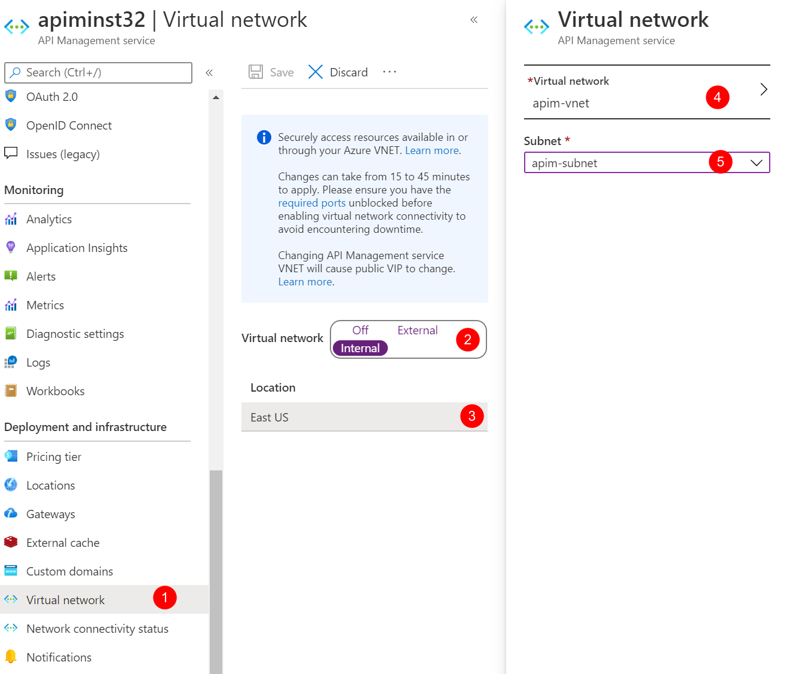

# Integrate Application Gateway and API Management in internal virtual network

In the previous tutorial, you created the virtual network, the private DNS zone and the API Management instance. In this tutorial, we continue integrating Application Gateway with API Management in the virtual network in Internal mode.

In this tutorial, you configure:

- The API Management instance in the virtual network in Internal mode
- An Application Gateway integrated with the API Management instance

## Connect API Management to the virtual network

1. In Azure Portal, open the API Management instance you created in the previous tutorial. 
1. Click **Virtual network** under **Deployment and infrastructure** to open the virtual network blade. 
1. Choose **Internal** for **Virtual network** and click the VNET option below to choose VNET and subnet. 
1. Choose **apim-vnet** for the virtual network and **apim-subnet** for the subnet. Click **Apply**. 
    
1. Click **Save** to apply the changes. The changes could take 15 to 45 minutes to be applied.

