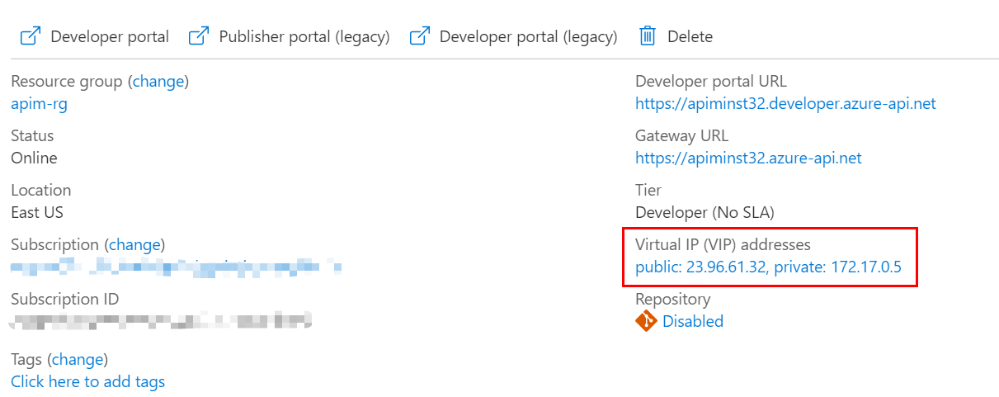
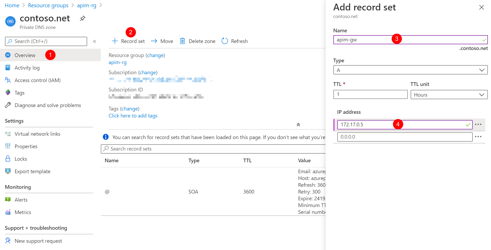
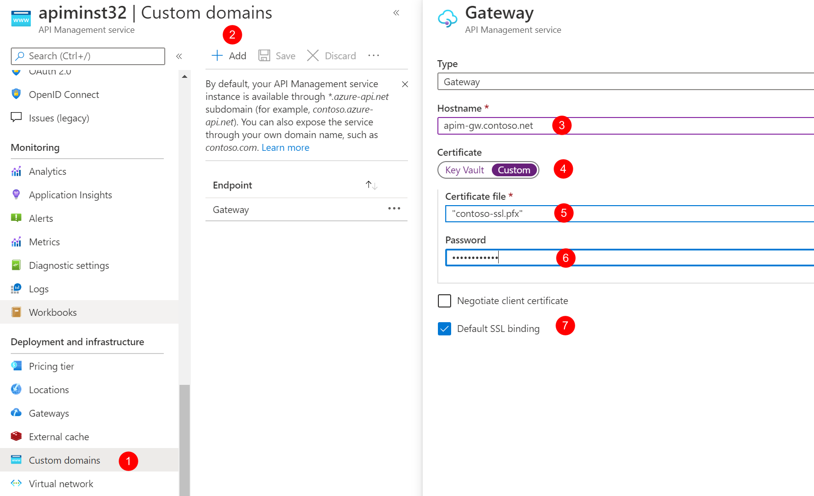

# Connect API Management to virtual network in Internal mode

In the previous tutorial, you created the virtual network, the private DNS zone and the API Management instance. In this tutorial, we continue integrating Application Gateway with API Management in the virtual network in Internal mode.

In this tutorial, you configure:

- The API Management instance in the virtual network in Internal mode
- An Application Gateway integrated with the API Management instance

## Connect APIM instance to the VNET in Internal mode

1. In Azure Portal, open the APIM instance you created in the previous tutorial.
1. Click **Virtual network** under **Deployment and infrastructure** to open the VNET integration page.
1. Choose **Internal** for **Virtual network** and click the VNET option below to choose the VNET and the subnet.
1. Choose **apim-vnet** for the virtual network and **apim-subnet** for the subnet. Click **Apply**.
    
1. Click **Save** to apply the changes. The changes could take 15 to 45 minutes to be applied.
1. When the APIM instance is deployed in the VNET successfully, you can find the **private** and **public** virtual IP addresses for the APIM instance on the **Overview** page. Take a note for the private IP address. We need to use it later.
    

For more information about the impact of the VNET Internal mode, please see [this document](https://docs.microsoft.com/azure/api-management/api-management-using-with-internal-vnet).

## Create custom domain names

With VNET Internal mode, we need to configure the APIM instance with custom domain names before we can access its service endpoints. In our scenarios, we need at least 2 domain names, one for the **Gateway** and the other for the **Management**.

1. In Azure Portal, open the private DNS zone **contoso.net**.
1. Click **Record set** to add a new record set.
1. Create the record set with **Name**: `apim-gw` and **IP address**: `172.17.0.5`.
    
1. Repeat the steps to create another record set with **Name**: `apim-mgmt` and **IP address**: `172.17.0.5`.

## Create self-signed certificates for SSL

We also need certificates for SSL bindings of APIM. In the production environment, you should use the certificates that are trusted by your organization. We use self-signed certificates in these tutorials just for demo purpose.

To make things easier, we create 2 certificates with the following PowerShell script. One of the certificates is a root certificate for signing, and the other is a wildcard certificate for SSL bindings of the custom domain names.

```PowerShell
# Create the root signing cert
$root = New-SelfSignedCertificate -Type Custom -KeySpec Signature `
    -Subject "CN=contoso-net-signing-root" -KeyExportPolicy Exportable `
    -HashAlgorithm sha256 -KeyLength 4096 `
    -CertStoreLocation "Cert:\CurrentUser\My" -KeyUsageProperty Sign `
    -KeyUsage CertSign -NotAfter (get-date).AddYears(5)
# Create the wildcard SSL cert.
$ssl = New-SelfSignedCertificate -Type Custom -DnsName "*.contoso.net","contoso.net" `
    -KeySpec Signature `
    -Subject "CN=*.contoso.net" -KeyExportPolicy Exportable `
    -HashAlgorithm sha256 -KeyLength 2048 `
    -CertStoreLocation "Cert:\CurrentUser\My" `
    -Signer $root
# Export CER of the root and SSL certs
Export-Certificate -Type CERT -Cert $root -FilePath .\contoso-signing-root.cer
Export-Certificate -Type CERT -Cert $ssl -FilePath .\contoso-ssl.cer
# Export PFX of the root and SSL certs
Export-PfxCertificate -Cert $root -FilePath .\contoso-signing-root.pfx `
    -Password (read-host -AsSecureString -Prompt "password")
Export-PfxCertificate -Cert $ssl -FilePath .\contoso-ssl.pfx `
    -ChainOption BuildChain -Password (read-host -AsSecureString -Prompt "password")
```

With the above script, you get the following 4 files.

- contoso-signing-root.cer
- contoso-signing-root.pfx
- contoso-ssl.cer
- contoso-ssl.pfx

Please note down the passwords you use for the PFX files. We need to use them later.

## Configure custom domain names for the APIM instance

In the production environment, Azure Key Vault is recommended to manage the certificates. We use the **Custom** option in this tutorial. For more information about configuring custom domain, please see [this document](https://docs.microsoft.com/azure/api-management/configure-custom-domain).

1. In the Azure Portal, go to the APIM instance.
1. Click **Custom domains** and click **Add**.
1. Configure the custom domain for the **Gateway** and **Management** with the following values.
    

Type    |Hostname    |Certificate file    |Password    |Default SSL binding 
--------|------------|--------------------|------------|---------------------
Gateway |apim-gw.contoso.net    |contoso-ssl.pfx    |_password of contoso-ssl.pfx_ |True
Management |apim-mgmt.contoso.net |contoso-ssl.pfx  |_password of contoso-ssl.pfx_ |True

4. Click **Save** to apply the changes.

The APIM instance is connected to the VNET in the Internal mode. You can move on to the next tutorial.
