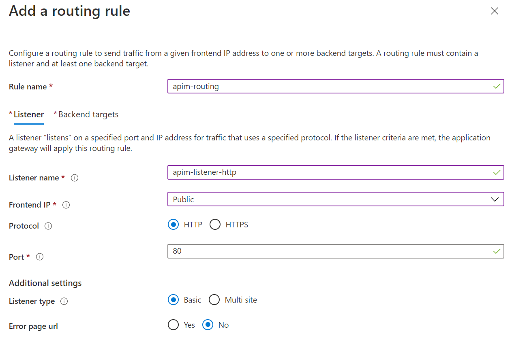
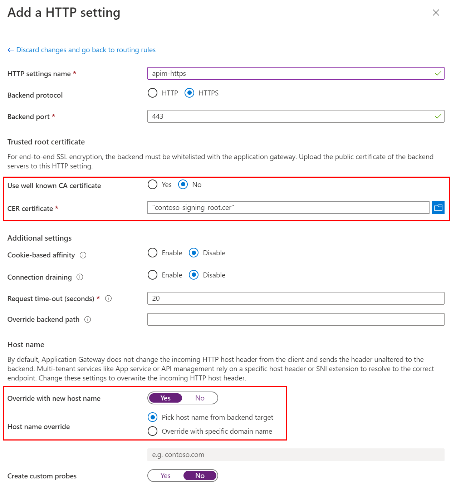
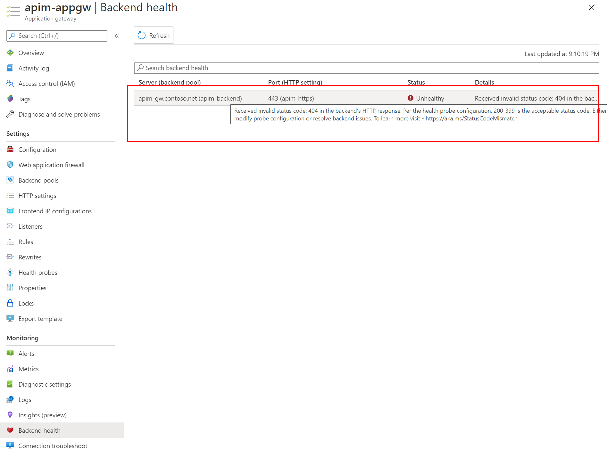
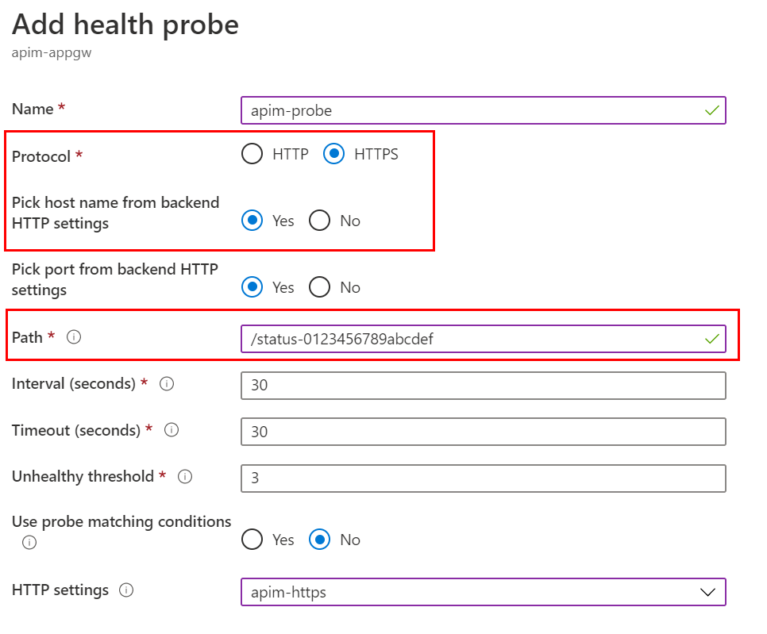
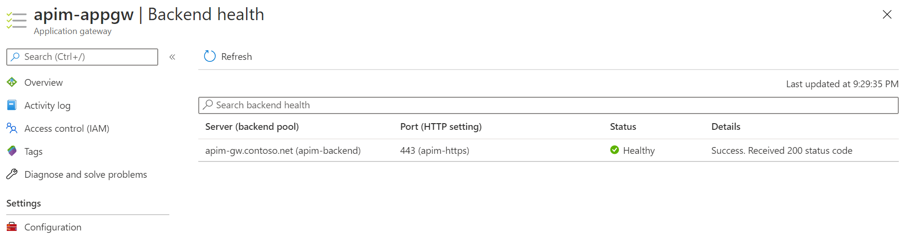

# Integrate the APIM instance with Application Gateway

In the last tutorial, you connected the APIM instance to the VNET in Internal mode and configured the custom domain names for it. In this tutorial, we continue integrating the APIM instance with an Application Gateway.

In this tutorial, you learn to:

- ✅ Create Application Gateway
- ✅ Create the custom healthy probe for APIM
- ✅ Verify the integration

## Create Application Gateway

1. In the Azure Portal, add a new resource by clicking **Create a resource** link.
1. Search and create `Application Gateway`.
1. Choose resource group `apim-rg`, region `East US`, and give it a name such as `apim-appgw`.
1. Choose VNET `apim-vnet` and subnet `appgw-subnet`. Click **Next: Frontends** button.
1. Choose `Public` for the frontend IP and create a new public IP address. And then click **Next: backend** button.
1. Add a backend pool as shown in the following diagram.

    

1. Move to **Configuration** and add a routing rule. The **Listener** of the routing rule is shown below.

    

1. Choose **apim-backend** as the **Backend target**, and add a new **HTTP settings** as shown below. Note that `contoso-signing-root.cer` is used for **CER certificate** and **Host name override** is set to pick the name from backend.

    

1. Move to **Tags** and add tags if you want. Then move to **Review + create**.
1. Click **Create** to create the AppGW.

## Create custom health probe

When the deployment of the AppGW is completed, if you go to the resource, you would notice that the backend status is unhealthy. That is because the default probe of AppGW doesn't work for APIM. We need to create a custom health probe for it.



1. Click **Health probes** and click **Add** to add a custom health probe. The details of the custom health probe are shown in the diagram below. Note the **Protocol** and host name settings. The **Path** of the APIM probe is `/status-0123456789abcdef`.

    

1. Uncheck **I want to test the backend health before adding the health probe** option and click **Add**.
1. Go to **Backend health**. The status of the backend should be **Healthy** now.

    

## Verify the integration

We can verify if the integration works by sending a request to the public IP address of the AppGW. We do it with [Azure Cloud Shell](https://docs.microsoft.com/azure/cloud-shell/overview) in this tutorial. You can also do it with other tools such as Postman.

1. In the Azure Portal, open Azure Cloud Shell. Choose **Bash** for the shell.
1. Run the following command with `curl`. You can find the [subscription](https://docs.microsoft.com/azure/api-management/api-management-subscriptions) key of APIM on its **Subscriptions** page, and the public IP address of AppGW on its **Overview** page.

    ```bash
    curl -I -H "Ocp-Apim-Subscription-Key: [subscription key]" http://[AppGW public IP]/echo/resource
    ```

1. If everything works, you get `HTTP 200 OK` in the response.

Now you've integrated the APIM instance with an AppGW. Let's move on to the next tutorial to expand the deployment further with a self-hosted gateway.
