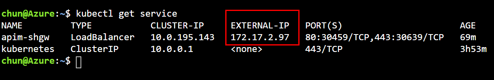
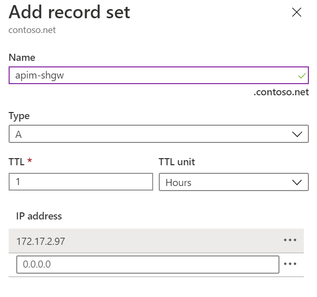
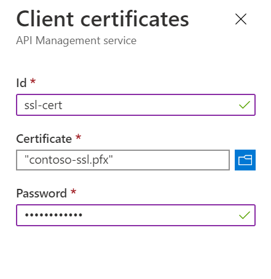
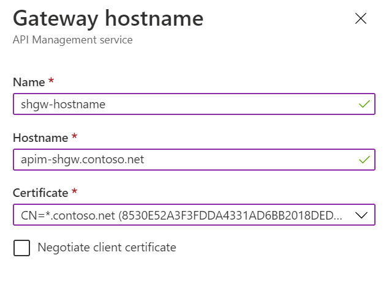
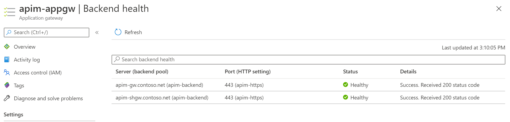

# Integrate Application Gateway with the self-hosted gateway

In the previous tutorial, you've deployed the self-hosted gateway in the AKS cluster. In this tutorial, you continue integrating it with the Application Gateway which is the last piece of the puzzle.

In this tutorial, you learn to:

- ✅ Configure the domain name for the self-hosted gateway
- ✅ Integrate the AppGW with the self-hosted gateway

## Configure the domain name for the self-hosted gateway

Before the self-hosted gateway can be added to the backend pool of the AppGW, you need to configure a custom domain name for it.

1. Open Cloud Shell and run the following command to find the IP address of the self-hosted gateway service.

    ```bash
    kubectl get service
    ```

1. Take a note of the **External-IP** address of **apim-shgw** service.

    > The external IP of the service is within the address space of the VNET because we used an internal load balancer for it.

    

1. In the Azure Portal, go to the private DNS zone `contoso.net`, add a new record set and point it to the IP address of the gateway service, as shown below.

    

1. Go to API Management in the Azure Portal.
1. Click **Certificates** and click **Add** to add the SSL certificate.
1. Add `contoso-ssl.pfx`, as shown below.

    

1. Open the self-hosted gateway settings by clicking **Gateways** and the gateway.
1. Click **Hostnames** and click **Add** to add a new host name for the gateway.

    

## Integrate AppGW with the self-hosted gateway

1. In the Azure Portal, go to Application Gateway.
1. Click **Backend pools** and the existing backend pool **apim-backend**.
1. Add `apim-shgw.contoso.net` as a new type of **IP address or FQDN** target.
1. When the backend target is added to the backend pool, click **Health probes** and the existing custom probe **apim-probe**.
1. Update the **Path** from `/status-0123456789abcdef` to `/internal-status-0123456789abcdef`. Uncheck **I want to test the backend health before adding the health probe** and click **Save** to save the changes.

    > At the moment, the documented probe path of APIM, `/status-0123456789abcdef`, doesn't work for the self-hosted gateway. `/internal-status-0123456789abcdef` is an undocumented probe path which works for both APIM and the self-hosted gateway temporarily. The APIM product team is working on an update of the probe path for the self-hosted gateway. You need to update the path again when the update is available.

1. Click **Backend health** to check the health of the backend. You should see both targets are healthy.

    

At this point, you've completed all tasks and steps that are needed to integrate Application Gateway, API Management and Self-Hosted Gateway in and internal virtual network.

Move on to the last tutorial of this series, we will run a quick test to see how the whole environment works.
