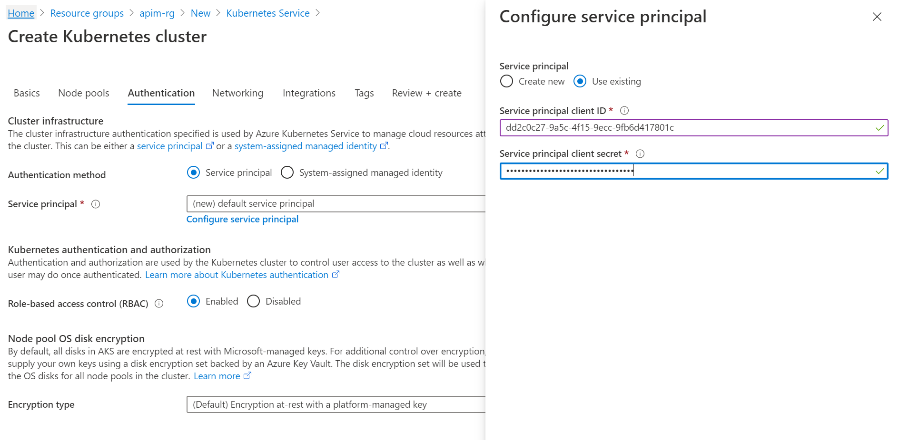
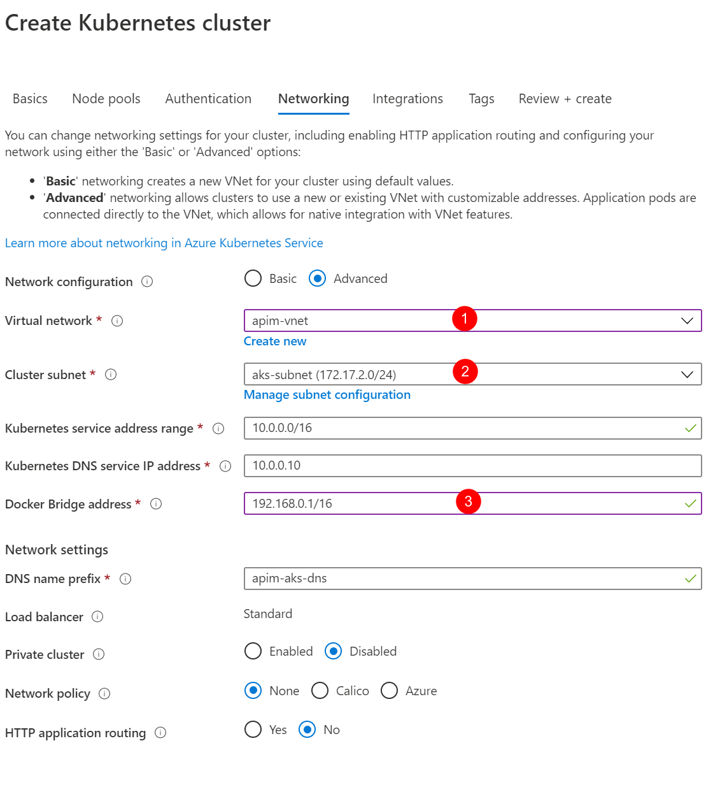
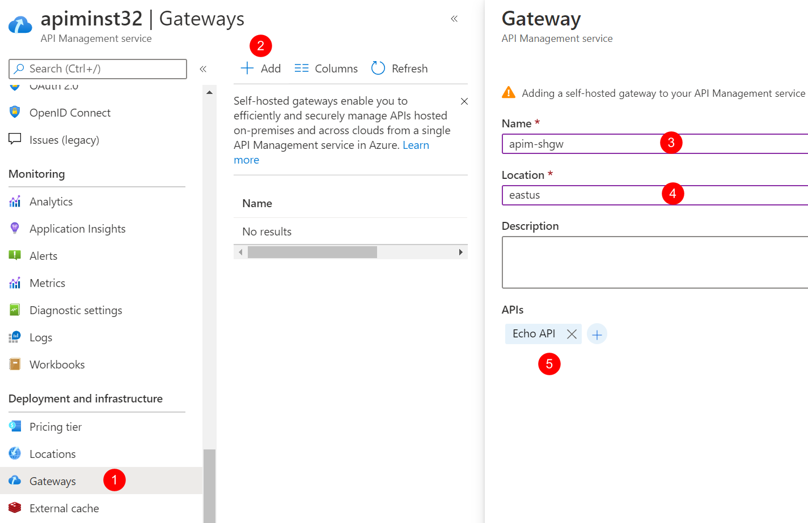
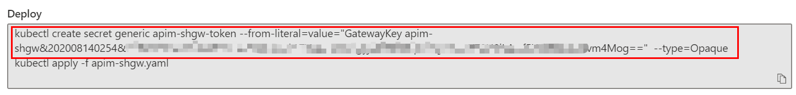
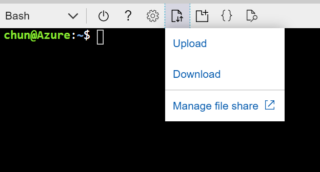
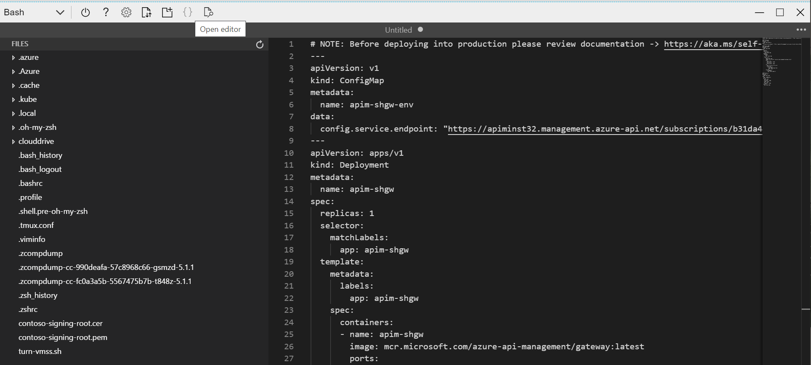
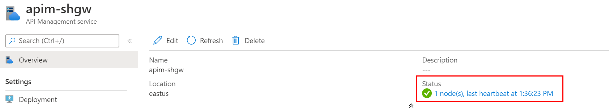

# Deploy self-hosted gateway

In the previous tutorials, you've deployed the APIM instance in the internal VNET and integrated it with the AppGW. In this tutorial, we expand the deployment with a [self-hosted gateway](https://docs.microsoft.com/azure/api-management/self-hosted-gateway-overview) to extend the capacity and redundancy of the APIM instance.

In this tutorial, you learn to:

- ✅ Deploy an Azure Kubernetes Service (AKS) cluster in the VNET
- ✅ Deploy a self-hosted gateway in the AKS cluster

## Deploy an AKS cluster to host the self-hosted gateway

The self-hosted gateway of APIM is a containerized, functionally-equivalent version of the managed gateway that is part of every APIM service deployed. It can be deployed to Docker, Kubernetes, or any other container orchestration solution running on a server cluster on premises, cloud infrastructure, or for evaluation and development purposes, on a personal computer. In this tutorial, we deploy an AKS cluster to host the self-hosted gateway.

### Create a service principal and assign permissions

To allow the AKS cluster to access the VNET and subnet, we need to configure it with a [service principal](https://docs.microsoft.com/azure/active-directory/develop/app-objects-and-service-principals#service-principal-object).

1. In the Azure Portal, open Cloud Shell and choose **Bash** as the shell.
1. Run the following command to create the service principal and note down the output.

    ```bash
    az ad sp create-for-rbac --skip-assignment
    ```

1. Assign the service principal **Network Contributor** role to the VNET with the following command. `<appId>` is the value of `appId` from the output of the above command.

    ```bash
    VNET_ID=$(az network vnet show --resource-group apim-rg --name apim-vnet --query id -o tsv)
    az role assignment create --assignee <appId> --scope $VNET_ID --role "Network Contributor"
    ```

### Deploy the AKS cluster with Azure Portal

We deploy the AKS cluster to the VNET and the corresponding subnet. For details about the AKS networking, please see [this document](https://docs.microsoft.com/azure/aks/configure-kubenet).

1. In the Azure Portal, add a new resource to the **apim-rg** resource group.
1. Search `Kubernetes Service` and click **Create**.
1. Choose resource group `apim-rg`, region `East US` and give the cluster a name such as `apim-aks`. Accept other default settings and move to **Next: Node pools**.
1. Accept default settings for node pools and move to **Next: Authentication**.
1. Choose **Service principal** as the **Authentication method** and click **Configure service principal** to configure it.
1. Choose **Use existing**, and input the **client ID** and **client secret**. They are the values of **appID** and **password** from the output of creating the service principal command.

    

1. Move to **Next: Networking**.
1. Choose **Advanced** for **Network configuration** option and apply other settings as shown in the diagram below.

    

1. Click **Review + create** and then click **Create** to deploy the AKS cluster.
1. When the deployment is completed, open Cloud Shell and run the following command. Make sure the cluster info of the AKS cluster can be shown.

    ```bash
    az aks get-credentials --resource-group apim-rg --name apim-aks
    kubectl cluster-info
    ```

## Deploy the self-hosted gateway

1. In the Azure Portal, go to the API Management.
1. Click **Gateways** and click **Add** to add a self-hosted gateway as shown below.

    

1. When the gateway is added, click it to open its settings.
1. Click **Deployment** and then click **Kubernetes**.

In normal cases, we can use the yaml to deploy the gateway straightly. But as we are in an internal VNET environment, we need to make some changes to the yaml before it can be deployed.

5. Open the Cloud Shell. Copy and run the following command to create the secret for the gateway key in AKS first.

    

As we are using custom domain names and self-signed SSL certificate, the certificate needs to be trusted by the self-hosted gateway. We create a configMap to install the certificate to the gateway pod.

> In production environment, you would want to use more secured options, such as Pod Identity and Azure Key Vault, to manage the certificates.

6. In the Cloud Shell, upload **contoso-signing-root.cer**.

    

1. Convert the CER to PEM before it can be used for the gateway pod.

    ```bash
    openssl x509 -inform der -in contoso-signing-root.cer -out contoso-signing-root.pem
    ```

1. Create a configMap in the AKS for the certificate.

    ```bash
    kubectl create configmap signing-root --from-file=contoso-signing-root.pem
    ```

We need to make 3 changes to the yaml file generated by APIM.

- Change the **config.service.endpoint** to use the custom domain name of the management service endpoint.
- Install the certificate to the pod so that it can be trusted by the pod.
- Use an [internal load balancer](https://docs.microsoft.com/azure/aks/internal-lb) to expose the gateway service.

9. Open the editor of the Cloud Shell, and then copy and paste the content of the yaml generated by APIM to it.

    

1. Change the domain name of **config.service.endpoint** to `apim-mgmt.contoso.net`.
1. Add the annotation for the internal load balancer, `service.beta.kubernetes.io/azure-load-balancer-internal: "true"`, to the service.
1. Create a volume based on the configMap `signing-root` and mount the `contoso-signing-root.pem` from it. The complete code of the yaml is shown below.

    > Note that you need to change the `<subscription id>` in **config.service.endpoint**.

    ```yml
    # NOTE: Before deploying into production please review documentation -> https://aka.ms/self-hosted-gateway-production
    ---
    apiVersion: v1
    kind: ConfigMap
    metadata:
      name: apim-shgw-env
    data: # change to the domain name of management endpoint
      config.service.endpoint: "https://apim-mgmt.contoso.net/subscriptions/<subscription id>/resourceGroups/apim-rg/providers/Microsoft.ApiManagement/service/apiminst32?api-version=2019-12-01"
    ---
    apiVersion: apps/v1
    kind: Deployment
    metadata:
      name: apim-shgw
    spec:
      replicas: 1
      selector:
        matchLabels:
          app: apim-shgw
      template:
        metadata:
          labels:
            app: apim-shgw
        spec:
          containers:
          - name: apim-shgw
            image: mcr.microsoft.com/azure-api-management/gateway:latest
            ports:
            - name: http
              containerPort: 8080
            - name: https
              containerPort: 8081
            env:
            - name: config.service.auth
              valueFrom:
                secretKeyRef:
                  name: apim-shgw-token
                  key: value
            envFrom:
            - configMapRef:
                name: apim-shgw-env
            volumeMounts: # mount the signing certificate
            - name: signing-root-volume
              mountPath: /etc/ssl/certs/contoso-signing-root.pem
              subPath: contoso-signing-root.pem
              readOnly: false
          volumes:
          - name: signing-root-volume
            configMap:
              name: signing-root
    ---
    apiVersion: v1
    kind: Service
    metadata:
      name: apim-shgw
      annotations: # use internal load balancer
        service.beta.kubernetes.io/azure-load-balancer-internal: "true"
    spec:
      type: LoadBalancer
      ports:
      - name: http
        port: 80
        targetPort: 8080
      - name: https
        port: 443
        targetPort: 8081
      selector:
        app: apim-shgw
    ```

1. Save the yaml to a file, `apim-shgw.yaml`, and run the following command to deploy it.

    ```bash
    kubectl apply -f ./apim-shgw.yaml
    ```

1. When the self-hosted gateway is deployed successfully, you would see 1 node in the status of the self-hosted gateway in the Azure Portal.

    

    > In case if the deployment is completed but the node in the status keeps showing 0, you can check the log of pod with `kubectl logs <pod-name>` to find out what is wrong. Possible reasons could be the URL of the management endpoint is incorrect or the root certificate is not installed properly.

In the next tutorial, we will integrate the self-hosted gateway with the Application Gateway.
