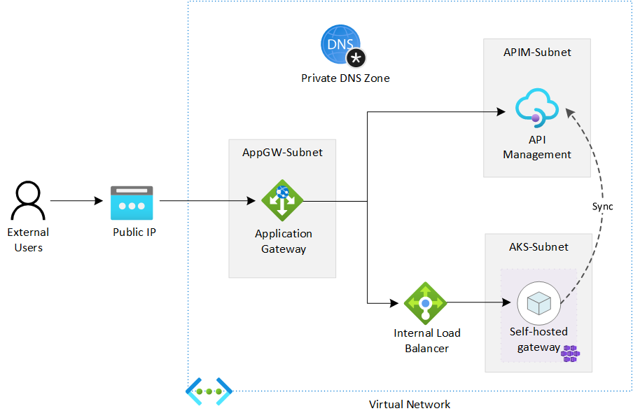

# Tutorials - Integrate Application Gateway, API Management and Self-Hosted Gateway in internal virtual network

## Overview

An API Management (APIM) instance can be deployed in a virtual network (VNET) in Internal mode and then integrated with an Azure Application Gateway (AppGW) to provide access to both internal and external users. We can expand the APIM instance further with a self-hosted gateway to extend the capacity and the redundancy of the APIM.

In this series of tutorials, we discuss how to integrate an AppGW with an APIM instance and a self-hosted gateway in an virtual network in internal mode. You will learn the detailed process and steps, as well as things and issues you may need to pay attention.

The following diagram shows the components we will deploy in the tutorials. It is not meant to be a reference architecture of APIM, but just to show you what the deployment would look like. As the purpose of the tutorials is to show the possibility and how-to for such a deployment, we start the deployment from scratch and do it step by step.

The deployment can be automated with ARM template or Azure PowerShell module. We use Azure Portal in the tutorials to better illustrate the process and the steps. To keep our focus on the integration of APIM and to make it easier for illustration, we only use the built-in Echo API for testing. There is no additional backend API.
