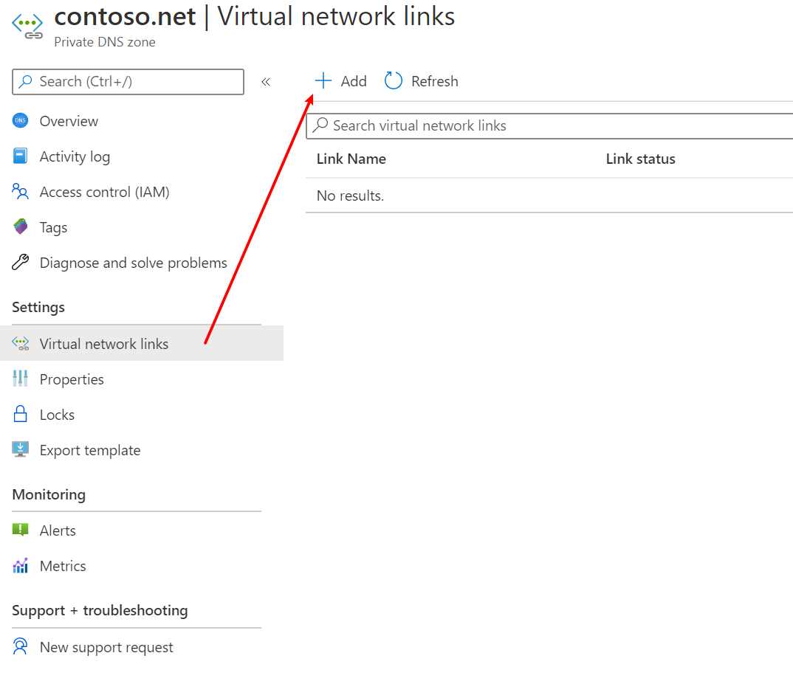

# Prepare the virtual network environment

In this tutorial, you learn to:

- Create a virtual network with 3 subnets
- Create a private DNS zone and link it to the virtual network
- Create an API Management instance

## Create the virtual network

As the first step, we create a virtual network with 3 subnets.

1. Open **Azure Portal**, click **Resource Groups**.
1. Click **Add** to add a new resource group.
1. Give the resource group a name, e.g. `apim-rg`, and choose a region such as **East US**. Click **Review + create** button, and then click **Create**.
1. When the resource group is create, click **Go to resource group** to open it.
1. On the resource group page, click **Add** to add a new resource.
1. In the search box, input `Virtual Network`, click it from the dropdown and click **Create**.
1. Give the virtual network a name, e.g. `apim-vnet`, and choose the same region of the resource group. Click **Next: IP Addresses**.
1. Input CIDR for **IPv4 address space**, such as `172.17.0.0/16`, and add the following 3 subnets.
  
|Subnet name    |Subnet address range  |
|---------------|----------------------|
|apim-subnet    |172.17.0.0/24         |
|appgw-subnet   |172.17.1.0/24         |
|aks-subnet     |172.17.2.0/24         |

9. Click **Review + create** and then click **Create** to create the virtual network.

## Configure the Private DNS Zone

When you deploy API Management in a virtual network in Internal mode, all its service endpoints are only visible within the virtual network. The default domain name of API Management, `azure-api.net`, which is managed by Azure, cannot be used to access the service endpoints anymore. As API Management service only responds to requests to the host name configured on its service endpoints and it does not listen to requests coming from IP addresses, you need to configure custom domain names for the endpoints, and therefore need a DNS service in the virtual network to manage the custom domain names.

In the tutorials, we use a Private DNS Zone to manage the custom domain names.

1. In Azure Portal, go to the **apim-rg** resource group. Click **Add** to add a new resource.
1. In the search box, input `Private DNS Zone`, click it on the dropdown and click **Create**.
1. Make sure **apim-rg** is selected as the resource group.
1. Input a top level domain name for **Name**. For example, we use `contoso.net` for it in the tutorials.
1. Click **Review + create** and then click **Create** to create the zone.
1. When the zone is created, click **Go to resource** to open it.
1. Click **Virtual network links** and then click **Add** to link it to the virtual network.
    
1. Give the link a name, e.g. `apim-vnet-link`, choose `apim-vnet` and check **Enable auto registration**. Click **OK**.

## Create the API Management instance

In the **apim-rg** resource group, create an API Management instance. For more details, please see [Create a new Azure API Management service instance](https://docs.microsoft.com/azure/api-management/get-started-create-service-instance).

Please make sure you choose **East US** as the region which is the same as the virtual network, and choose either `Developer` or `Premium` as the **Pricing tier**. Only these two tiers support the virtual network integration.

When the APIM instance is created, all steps in this tutorial are completed. Let's move to the next one.
