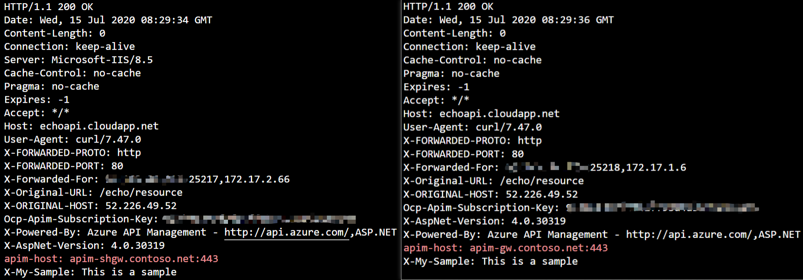

# Verify the deployment

In the previous tutorials, you've deployed the following environment in Azure. In this tutorial, we test if the deployment works as expected, and if the requests can be load balanced and handled by both APIM and the self-hosted gateway.


In this tutorial, you learn to:

- ✅ Send requests to API Management through Application Gateway
- ✅ Verify if the requests are distributed to both API Managenet and the self-hosted gateway

## Send requests through Application Gateway

1. In the Azure Portal, open Azure Cloud Shell. Choose **Bash** for the shell.
1. Run the following command with `curl`. You can find the [subscription](https://docs.microsoft.com/azure/api-management/api-management-subscriptions) key of APIM on its **Subscriptions** page, and the public IP address of AppGW on its **Overview** page.

    ```bash
    curl -I -H "Ocp-Apim-Subscription-Key: [subscription key]" http://[AppGW public IP]/echo/resource
    ```

1. If everything works, you get `HTTP 200 OK` in the response.

## Test if the requests are distributed to both APIM and the self-hosted gateway

To test if the requests are handled by either APIM or the self-hosted gateway, you can send HTTP header `Ocp-Apim-Trace` to enable the trace of APIM. To make the verification even more intuitive, we use a custom policy to retrieve the host from APIM.

1. In the Azure Portal, go to API Management.
1. Click **APIs** > **Echo API** > **All operations**.
1. Click **</>** on the **Inbound processing** card to open the policy editor.
1. Replace the code in the policy editor with the code below.

    ```xml
    <policies>
        <inbound>
            <base />
            <set-variable name="inbound-host" value="@(context.Request.Headers.GetValueOrDefault("Host"))" />
        </inbound>
        <backend>
            <base />
        </backend>
        <outbound>
            <base />
            <set-header name="apim-host" exists-action="override">
                <value>@((string)context.Variables["inbound-host"])</value>
            </set-header>
        </outbound>
        <on-error>
            <base />
        </on-error>
    </policies>
    ```

1. In the Cloud Shell, run the same `curl` command as shown in the previous section. Run the command multiple times. You'll notice that the `apim-header` in the response could be either `apim-gw.contoso.net`, which is the APIM instance, or `apim-shgw.contoso.net`, which is the self-hosted gateway. AppGW uses the round robin to distribute the requests to both of them.

    

You've completed this series of tutorials. Congratulations! 🎉
